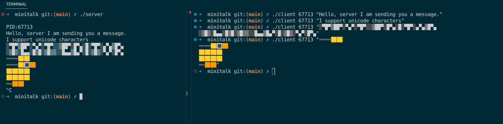

# Minitalk

*This project has been created as part of the 42 curriculum by dloustal*


### Description

This project is about creating a communication program between two processes: a client and a server. The client sends messages to the server through UNIX signals. 

### Instructions

To run, make the project with ```make```, then start the server with ```./server```. It will return the process ID (PID) and wait for messages. To quit the server, kill the process, for example with ```Ctrl^C```. To send messages to the server, start the client (in another terminal) with ```./client <Server PID> <Message>```. The message will be repeated by the server. 

### Example

<figure>
	
	<figcaption> </figcaption>
</figure>